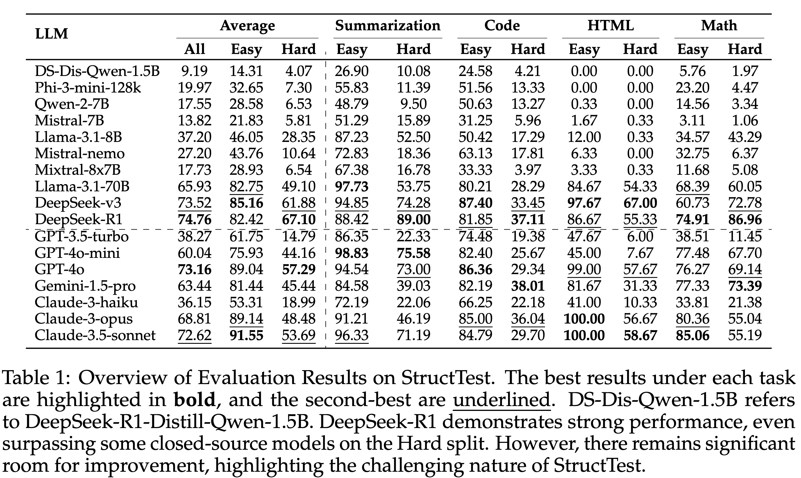

# StructTest: Benchmarking LLMs’ Reasoning through Compositional Structured Outputs
This repo holds codes, scripts and outputs for paper [StructTest: Benchmarking LLMs’ Reasoning through Compositional Structured Outputs](https://arxiv.org/abs/2412.18011) by Hailin Chen, Fangkai Jiao, Mathieu Ravaut, Nawshad Farruque, Xuan Phi Nguyen, Chengwei Qin, Manan Dey, Bosheng Ding, Caiming Xiong, Shafiq Joty, Yingbo Zhou.

## Leaderboard
<!--  -->


## Installation
1. Create a new python environment and install the project:
```bash
pip install -e .
python -m nltk.downloader punkt punkt_tab
```
3. Set up the environment:
```bash
export PYTHONPATH=$(dirname `pwd`)/StructTest
```

## Run Eval (new local models)

### Step 1 - Model Serving 
Serve the local model with vllm following [Model Serving](#model-serving)

### Step 2 - Edit Model Config
Edit [config.json](config.json) to add new model config to `model_configs`:

#### Type 1: OpenAI API
by setting `type` as `OpenAI`, we use OpenAI client to query the served model. In this mode, the chat template is applied by `tokenizer.apply_chat_template()`, where the `tokenizer` is specified in [Model Serving](#model-serving). For example:
```json
{
    "hf_token": "{your_hf_token}",
    "model_configs": {
        "qwen2.5-0.5b-instruct": {
            "model_name": "{model name/path used in vllm serving, e.g. Qwen/Qwen2.5-0.5B-Instruct}",
            "type": "OpenAI",
            "api_key": "na",
            "base_url": "http://127.0.0.1:8000/v1"
        }
    }
}
```
#### Type 2: http post request
by setting `type` as `OpenAI`, we use HTTP POST to query the served model. In this mode, your need to pass a chat template with a `{prompt}` keyword inside. For example:
```json
{
    "hf_token": "{your_hf_token}",
    "model_configs": {
        "qwen2.5-0.5b-instruct": {
            "model_name": "{model name/path used in vllm serving, e.g. Qwen/Qwen2.5-0.5B-Instruct}",
            "type": "vllm_post",
            "template": "<|user|>\n{prompt}</s>\n<|assistant|>\n",
            "base_url": "http://127.0.0.1:8000"
        }
    }
}
```

### Step 3 - Run Evaluation
Run evaluation against the model:
```bash
sh tests/{domain}/test_new_models.sh -n {num_of_process} -m {model_identifier} -t {timeout in seconds, default 30}
```
where {domain} can be either summarization/code/html/math and {model_identifier} is the model name/path used in vllm serving. Example command:
```bash
sh tests/code/test_new_models.sh -n 1 -m qwen2.5-0.5b-instruct -t 30
```

## Run Eval (new online models supporting OpenAI API)
To eval a new online model that accepts OpenAI API requests:
### Step 1 - Edit Model Config
Edit [config.json](config.json) to add new model config to `model_configs`. Example config for deepseek-chat:
```json
{
    "hf_token": "{your_hf_token}",
    "model_configs": {
        "deepseek-v3": {
            "model_name": "deepseek-chat",
            "type": "OpenAI",
            "api_key": "{your_api_key}",
            "base_url": "https://api.deepseek.com"
        },
    }
}
```

### Step 2 - Run Evaluation
Run evaluation against the model:
```bash
sh tests/{domain}/test_new_models.sh -n {num_of_process} -m {model_identifier} -t {timeout in seconds, default 30}
```
where {domain} can be either summarization/code/html/math and {model_identifier} is the key defined in model_configs (e.g., deepseek-v3). Example command:
```bash
sh tests/code/test_new_models.sh -n 1 -m deepseek-v3 -t 60
```

## Model Serving
For serving a local model, we recommend using vllm.

Method 1 (vllm docker):
1. Make sure `docker` is installed. Then pull vllm official image `docker pull vllm/vllm-openai:latest`
2. Run vllm serving in a docker container by executing the following script. Change `model_name`, `tokenizer`, `cache_dir` to customize
```bash
sh tests/vllm_serving_docker.sh
```

Method 2 (vllm python): 
1. install a seperate python environment and install vllm following [vllm official install guide](https://docs.vllm.ai/en/stable/getting_started/installation.html)
2. Execute the following script to serve a local model. Change `model_name`, `tokenizer`, `download_dir`, `num_GPUs` to customize
```bash
sh tests/vllm_serving.sh
```

Method 3 (ollama):
1. Install ollama ([official guide](https://ollama.com/download)) and export `OLLAMA_HOST=http://localhost:8000` in all terminals below.
2. Run `ollama serve`
3. In another terminal, run `ollama pull {model_name}`
    1. By default, ollama sets input context length to be 2048 tokens. We need to set it to 32K for StructTest. Follow [this solution](https://github.com/ollama/ollama/issues/6286#issuecomment-2418807319) for larger context length.

## Run Eval on existing models
### For online models
1. set api_keys in `.env` and `source .env`
2. Run
```bash
sh tests/run_all_models.sh -m gpt-3.5 -n 3 -t 120
sh tests/run_all_models.sh -m gpt-4o-mini -n 3 -t 120
sh tests/run_all_models.sh -m gpt-4o -n 3 -t 120
sh tests/run_all_models.sh -m gemini-1.5-pro -n 3 -t 120
sh tests/run_all_models.sh -m claude-3-haiku -n 3 -t 120
sh tests/run_all_models.sh -m claude-3-opus -n 3 -t 120
sh tests/run_all_models.sh -m claude-3.5-sonnet -n 3 -t 120
```
### For local models
1. use a seperate terminal tab to run `sh tests/vllm_serving_docker_smart.sh -m {model_name} -n 10 -t 120`
2. use another terminal tab to run `sh tests/run_all_models.sh -m {modle_name} -n 10 -t 120`

The model names include:
```bash
Llama3.1-8b-instruct_release
Mistral-7B-Instruct-v0.2_release
Llama3.1-70b-instruct_release
mixtral_release
Qwen2-7B-Instruct_release
Phi-3-mini-128k-instruct_release
mistral_nemo_release
```

### Cite
```bibtex
@article{DBLP:journals/corr/abs-2412-18011,
  author       = {Hailin Chen and
                  Fangkai Jiao and
                  Mathieu Ravaut and
                  Nawshad Farruque and
                  Xuan{-}Phi Nguyen and
                  Chengwei Qin and
                  Manan Dey and
                  Bosheng Ding and
                  Caiming Xiong and
                  Shafiq Joty and
                  Yingbo Zhou},
  title        = {StructTest: Benchmarking LLMs' Reasoning through Compositional
                  Structured Outputs},
  journal      = {CoRR},
  volume       = {abs/2412.18011},
  year         = {2024}
}